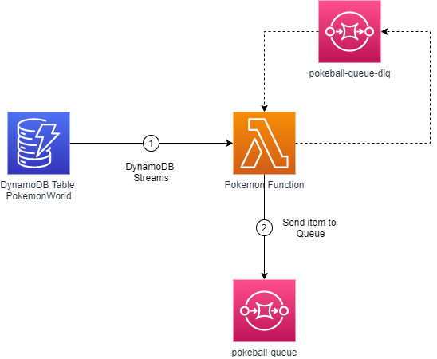

# Pokemon Lambda SQS

This project is an example created by me to train on creating an AWS Serverless architecture.

## Architecture



## Config CloudFormation

You must update yours environment variables in [template.yaml](template.yaml):

``` yaml
Environment:
    Variables:
      AWS_ACCESS_KEY_ID: {{}}
      AWS_SECRET_ACCESS_KEY: {{}} 
```

## Get Started 

Build your application with the `sam build --use-container` command.

```bash
pokemon-lambda-sqs$ sam build --use-container
```

--- 
Developed by [Jean Jacques Barros](https://github.com/jjeanjacques10/)
